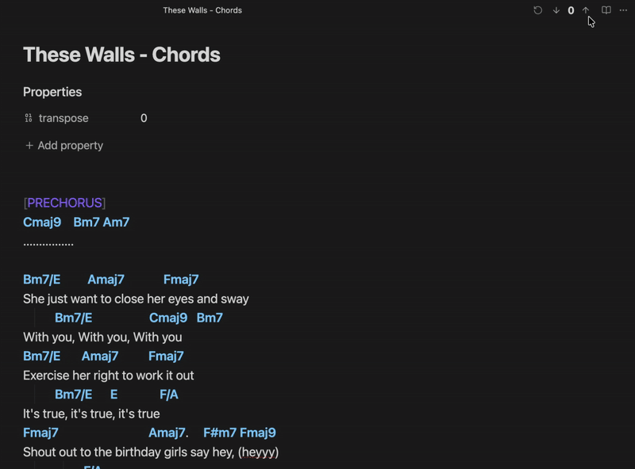

# Obsidian Chord Transposer

A **minimalist, zero-friction** chord transposer for Obsidian.

_Chord Transposer_ automatically detects chord lines in your song lyrics and lets you transpose them instantly. No complex code blocks, no proprietary syntax, no lock-in. Just plain text. Works seamlessly across Desktop, Tablet, and Mobile.



## ✨ Why this plugin?

Most chord plugins require you to format your songs in specific code blocks (e.g., ` ```chords `). This breaks the flow of writing and makes your notes look like code.

**Chord Transposer is different:**
*   **Plain Text First:** It works on standard Markdown text. Copy-paste lyrics from the web, and it just works.
*   **Portable Data:** When you transpose a song, the plugin updates the **actual text** in your file. If you open your file in another editor, the chords are still correct.
*   **Intuitive UI:** Transpose controls appear automatically in the header, but only when chords are detected.

## 🚀 Features

*   **Automatic Detection:** Uses a smart heuristic algorithm (RegEx + logical analysis) to identify lines containing chords versus lyrics.
*   **Live Syntax Highlighting:** Instantly highlights recognized chords in your editor (CodeMirror 6 integration) without changing your theme.
*   **One-Click Transposition:** Transpose Up/Down semitones directly from the view header.
*   **Smart Parsing:** Handles complex chords (`F#m7`, `D/F#`) and ignores common English words that look like chords (e.g., "Face", "Bad").
*   **State Persistence:** Remembers the transposition setting for each song by saving it in the file's Frontmatter (YAML).
*   **Octave Reset:** Automatically resets the counter to 0 upon reaching +/- 12 semitones.

## 🛠️ Installation

### Via BRAT (Recommended for Beta)
1.  Install the **BRAT** plugin from the Community Plugins browser.
2.  Open BRAT settings -> "Add Beta plugin".
3.  Paste the repository URL

### Manual Installation
1.  Download `main.js`, `manifest.json`, and `styles.css` from the latest Release.
2.  Create a folder `obsidian-smart-chords` in your vault at `.obsidian/plugins/`.
3.  Move the files into that folder.
4.  Reload Obsidian.

### Obsidian Community
1. After it got approved, directly install from Obsidian Community Plugins

## 🎮 Usage

1.  Open a note containing a song.
2.  **That's it.** The plugin scans the text.
3.  If chords are detected, a control widget appears in the top-right header:
    *   **[↓]**: Transpose down.
    *   **[↑]**: Transpose up.
    *   **[↺]**: Reset to original key (0).
4.  The current transposition value is saved in your file metadata:

```yaml
---
transpose: 2
---
```

## 🧠 Logic & Recognition

The plugin uses a sophisticated "Strict Regex" approach to differentiate between music and text:
*   **Allowed:** Standard chords (`Am`, `G7`, `F#m`), Slash chords (`D/F#`), and extensions (`6/9`, `maj7`, `dim`).
*   **Ignored:** Common English words that resemble chords are automatically filtered out (e.g., "Aged", "Cafe", "Face", "Dad").
*   **Threshold:** A line is considered a "Chord Line" if >40% of the tokens are recognized as valid musical chords.

## 💻 Development

This plugin was built using TypeScript and the Obsidian API.

1.  Clone the repository.
2.  Install dependencies: `npm install`
3.  Build: `npm run build`

## 📄 License

MIT License. Feel free to fork, modify, and use it as you wish.